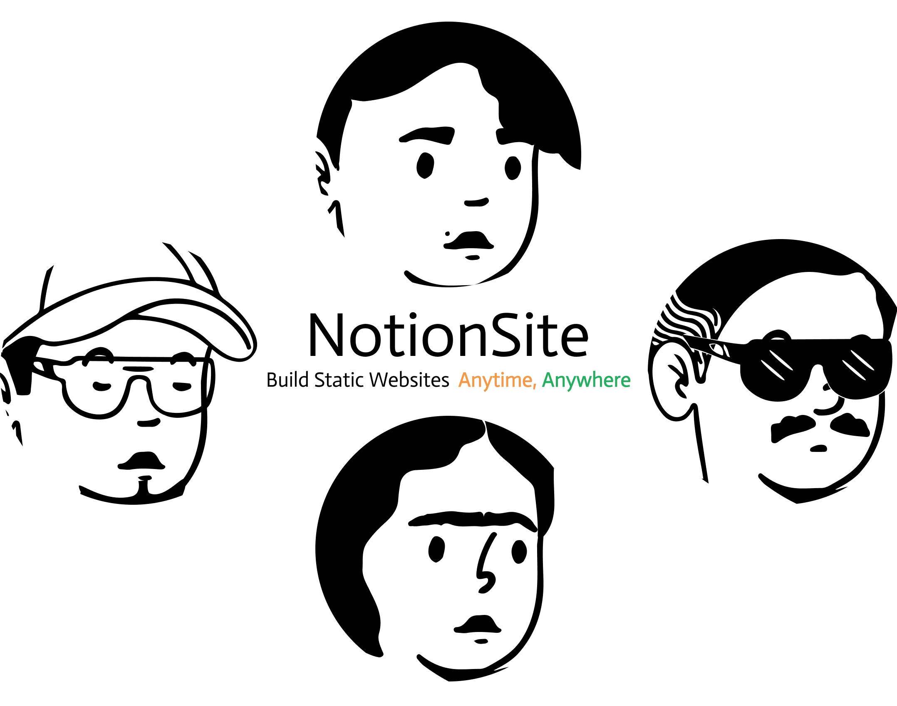

# notion-site

Read Notion-Site Doc: https://ns-doc.env.wtf，And the documentation is built on [this Notion page](https://zhuangwenda.notion.site/2bd00e5dfff3449ba81e0142f8af9bbb?v=065c41ad42be4683966e10f476e60afd) 



[](https://github.com/pkwenda/notion-site/releases)
[](https://github.com/pkwenda/notion-site/blob/master/LICENSE)

**notion-site** is an open source software for a custom website based on [Notion](https://www.notion.so/) and [Hugo](https://gohugo.io/), and you can find your favorite template as your blog or documentation site among the hundreds of templates in the [Hugo Template Store](https://themes.gohugo.io/).

## Requisites
- Notion Database id for your articles.
- Notion API secret token.


## Setup

### install.sh

```bash
curl -sSf https://raw.githubusercontent.com/pkwenda/notion-site/master/install.sh | sh
```
 

## Usage


```bash
cd your-hugo-site
notion-site init
notion-site
```

### Github Action

> The installation command tool is helpful for local debugging. If you do not want to debug locally, you can also copy the configuration file to your project and run it directly through GitHubAction. You can see the example config in [notion-site-doc](https://github.com/pkwenda/notion-site-doc/tree/main/.github/workflows).

To use it as a Github Action, you can use the template  of the repository
in [.github/worflows/notion.yml](.github/workflows/notion.yml).

## Contributing

See [CONTRIBUTING](CONTRIBUTING.md) for details on submitting patches and the contribution workflow.

## Special thanks

- [go-notion](https://github.com/dstotijn/go-notion)
- [xzebra](https://github.com/xzebra)
- [saltbo](https://github.com/saltbo)


 
## License

notion-site is under the MIT license. See the [LICENSE](/LICENSE) file for details.